# Diagramas de diseño

Documento generado desde los archivos `.mmd`. Editar las fuentes y ejecutar `npm run docs:diagrams`. Mermaid admite clases, secuencias y estados UML; para componentes, paquetes, actividades y despliegue se emplea flowchart como aproximación explícita, no notación UML estricta. Las fuentes son editables y no dependen de un servicio remoto.

## 01 · Contexto del sistema

Contexto, en flowchart: personas, aplicación y almacenamiento. No representa un backend.

[Fuente Mermaid](diagrams/01-contexto.mmd)

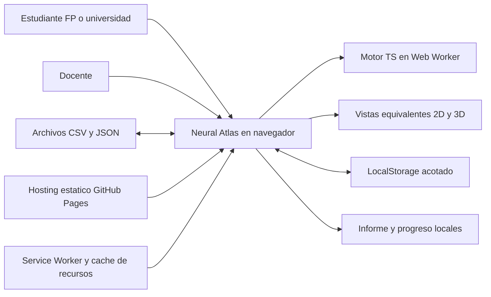
```mermaid
flowchart LR
  Estudiante[Estudiante FP o universidad] --> App[Neural Atlas en navegador]
  Docente[Docente] --> App
  App --> Motor[Motor TS en Web Worker]
  App --> Vistas[Vistas equivalentes 2D y 3D]
  App <--> Local[LocalStorage acotado]
  Archivos[Archivos CSV y JSON] <--> App
  Pages[Hosting estatico GitHub Pages] --> App
  SW[Service Worker y cache de recursos] --> App
  App --> Evidencia[Informe y progreso locales]
```

## 02 · Componentes y ejecución

Vista de componentes expresada mediante flowchart; explicita la frontera entre hilo principal y Worker.

[Fuente Mermaid](diagrams/02-componentes.mmd)

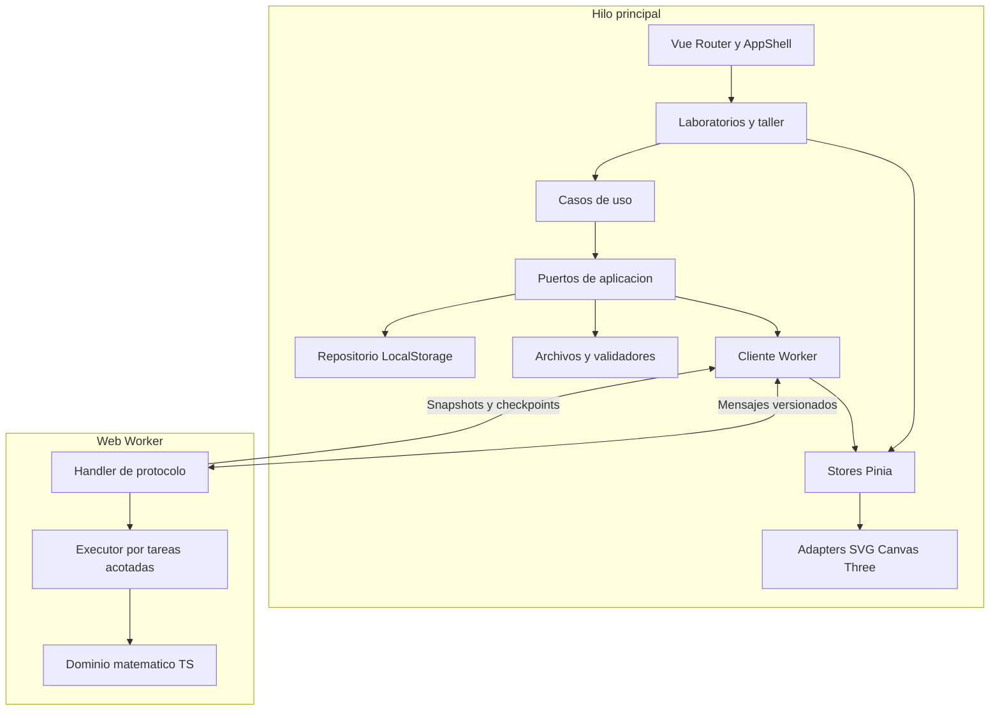
```mermaid
flowchart TB
  subgraph Principal[Hilo principal]
    Vue[Vue Router y AppShell] --> Features[Laboratorios y taller]
    Features --> Casos[Casos de uso]
    Features --> Stores[Stores Pinia]
    Stores --> Render[Adapters SVG Canvas Three]
    Casos --> Ports[Puertos de aplicacion]
    Ports --> Repo[Repositorio LocalStorage]
    Ports --> Files[Archivos y validadores]
    Ports --> Client[Cliente Worker]
  end
  subgraph Aislado[Web Worker]
    Handler[Handler de protocolo] --> Executor[Executor por tareas acotadas]
    Executor --> Domain[Dominio matematico TS]
  end
  Client <-->|Mensajes versionados| Handler
  Handler -->|Snapshots y checkpoints| Client
  Client --> Stores
```

## 03 · Clases de dominio

UML de clases: composición del experimento, dataset, partición, pipeline, red y checkpoints.

[Fuente Mermaid](diagrams/03-clases-dominio.mmd)

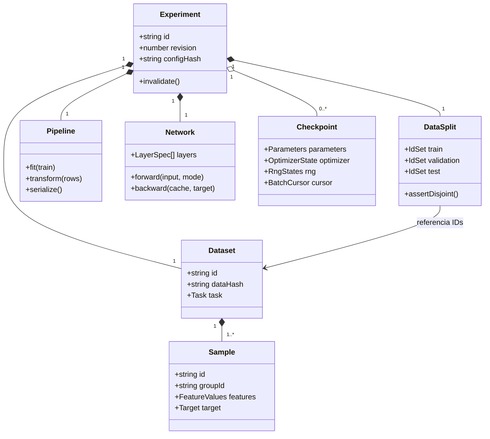
```mermaid
classDiagram
  class Experiment {
    +string id
    +number revision
    +string configHash
    +invalidate()
  }
  class Dataset {
    +string id
    +string dataHash
    +Task task
  }
  class Sample {
    +string id
    +string groupId
    +FeatureValues features
    +Target target
  }
  class DataSplit {
    +IdSet train
    +IdSet validation
    +IdSet test
    +assertDisjoint()
  }
  class Pipeline {
    +fit(train)
    +transform(rows)
    +serialize()
  }
  class Network {
    +LayerSpec[] layers
    +forward(input, mode)
    +backward(cache, target)
  }
  class Checkpoint {
    +Parameters parameters
    +OptimizerState optimizer
    +RngStates rng
    +BatchCursor cursor
  }
  Experiment "1" *-- "1" Dataset
  Dataset "1" *-- "1..*" Sample
  Experiment "1" *-- "1" DataSplit
  DataSplit --> Dataset : referencia IDs
  Experiment "1" *-- "1" Pipeline
  Experiment "1" *-- "1" Network
  Experiment "1" o-- "0..*" Checkpoint
```

## 04 · Dependencias entre paquetes

Vista de paquetes aproximada en flowchart; las flechas indican importaciones permitidas.

[Fuente Mermaid](diagrams/04-paquetes.mmd)

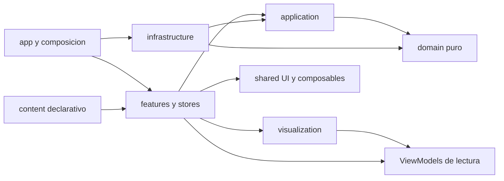
```mermaid
flowchart LR
  App[app y composicion] --> UI[features y stores]
  App --> Infra[infrastructure]
  UI --> UseCases[application]
  UI --> Viz[visualization]
  UI --> Shared[shared UI y composables]
  UseCases --> Domain[domain puro]
  Infra --> UseCases
  Infra --> Domain
  Viz --> VM[ViewModels de lectura]
  UI --> VM
  Content[content declarativo] --> UI
```

## 05 · Secuencia de entrenamiento

UML de secuencia: INIT, RUN, snapshots y finalización. Los mensajes están versionados.

[Fuente Mermaid](diagrams/05-secuencia-entrenamiento.mmd)

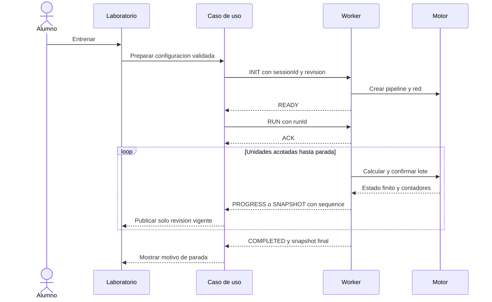
```mermaid
sequenceDiagram
  actor A as Alumno
  participant UI as Laboratorio
  participant C as Caso de uso
  participant W as Worker
  participant M as Motor
  A->>UI: Entrenar
  UI->>C: Preparar configuracion validada
  C->>W: INIT con sessionId y revision
  W->>M: Crear pipeline y red
  W-->>C: READY
  C->>W: RUN con runId
  W-->>C: ACK
  loop Unidades acotadas hasta parada
    W->>M: Calcular y confirmar lote
    M-->>W: Estado finito y contadores
    W-->>C: PROGRESS o SNAPSHOT con sequence
    C-->>UI: Publicar solo revision vigente
  end
  W-->>C: COMPLETED y snapshot final
  C-->>UI: Mostrar motivo de parada
```

## 06 · Secuencia de importación

UML de secuencia: comprobar tamaño, mapear columnas y confirmar una sesión válida.

[Fuente Mermaid](diagrams/06-secuencia-importacion.mmd)

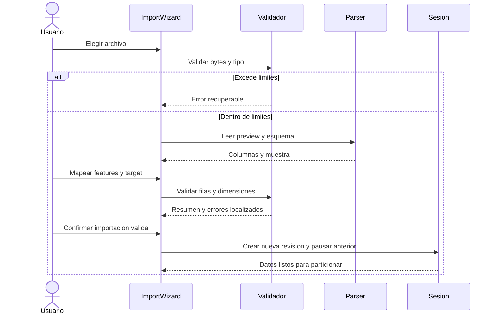
```mermaid
sequenceDiagram
  actor A as Usuario
  participant UI as ImportWizard
  participant V as Validador
  participant P as Parser
  participant S as Sesion
  A->>UI: Elegir archivo
  UI->>V: Validar bytes y tipo
  alt Excede limites
    V-->>UI: Error recuperable
  else Dentro de limites
    UI->>P: Leer preview y esquema
    P-->>UI: Columnas y muestra
    A->>UI: Mapear features y target
    UI->>V: Validar filas y dimensiones
    V-->>UI: Resumen y errores localizados
    A->>UI: Confirmar importacion valida
    UI->>S: Crear nueva revision y pausar anterior
    S-->>UI: Datos listos para particionar
  end
```

## 07 · Estados de sesión

UML de estados: ejecución, pausa, cancelación y recuperación. Cerrar mientras se ejecuta exige cancelar primero.

[Fuente Mermaid](diagrams/07-estados-sesion.mmd)

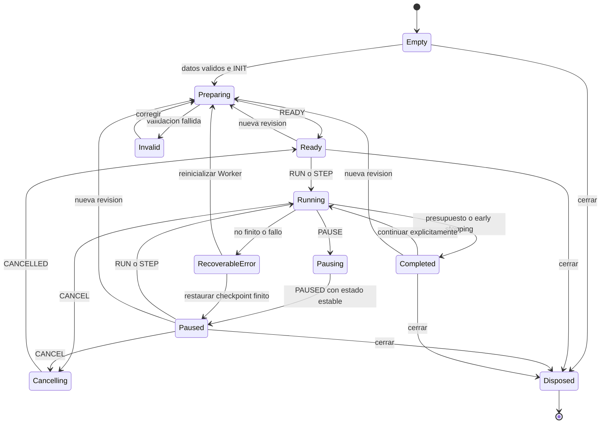
```mermaid
stateDiagram-v2
  [*] --> Empty
  Empty --> Preparing: datos validos e INIT
  Preparing --> Ready: READY
  Preparing --> Invalid: validacion fallida
  Invalid --> Preparing: corregir
  Ready --> Running: RUN o STEP
  Running --> Pausing: PAUSE
  Pausing --> Paused: PAUSED con estado estable
  Paused --> Running: RUN o STEP
  Running --> Completed: presupuesto o early stopping
  Completed --> Running: continuar explicitamente
  Running --> Cancelling: CANCEL
  Paused --> Cancelling: CANCEL
  Cancelling --> Ready: CANCELLED
  Running --> RecoverableError: no finito o fallo
  RecoverableError --> Paused: restaurar checkpoint finito
  RecoverableError --> Preparing: reinicializar Worker
  Ready --> Preparing: nueva revision
  Paused --> Preparing: nueva revision
  Completed --> Preparing: nueva revision
  Empty --> Disposed: cerrar
  Ready --> Disposed: cerrar
  Paused --> Disposed: cerrar
  Completed --> Disposed: cerrar
  Disposed --> [*]
```

## 08 · Actividad del pipeline

Actividad representada en flowchart: ajustar solo con train y reservar test hasta congelar selección.

[Fuente Mermaid](diagrams/08-actividad-pipeline.mmd)

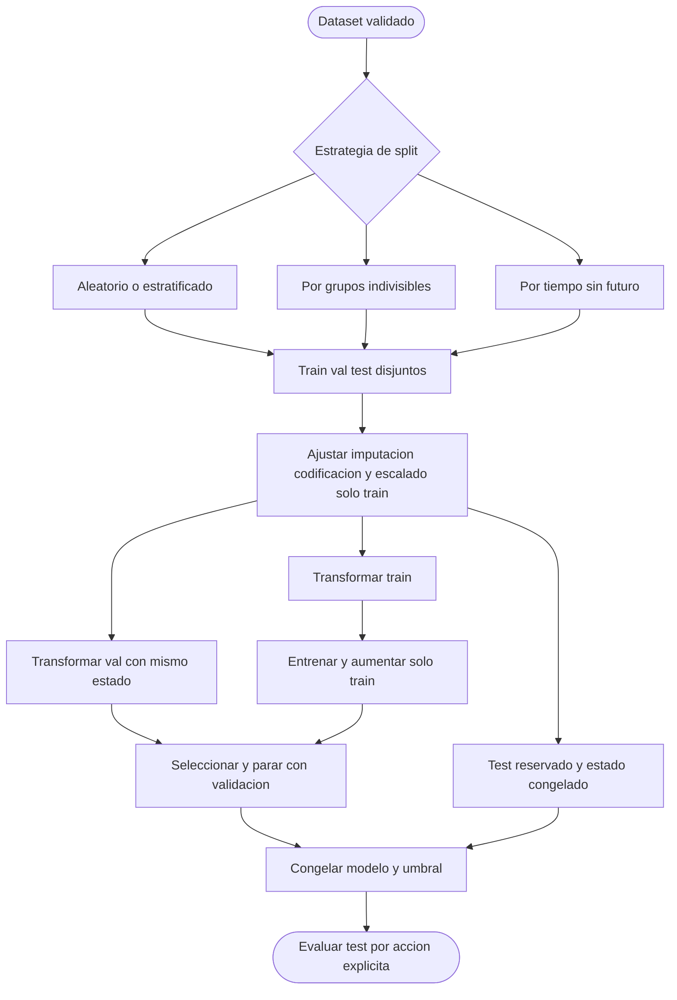
```mermaid
flowchart TD
  Start([Dataset validado]) --> Split{Estrategia de split}
  Split --> Random[Aleatorio o estratificado]
  Split --> Groups[Por grupos indivisibles]
  Split --> Time[Por tiempo sin futuro]
  Random --> IDs[Train val test disjuntos]
  Groups --> IDs
  Time --> IDs
  IDs --> Fit[Ajustar imputacion codificacion y escalado solo train]
  Fit --> Train[Transformar train]
  Fit --> Val[Transformar val con mismo estado]
  Fit --> Test[Test reservado y estado congelado]
  Train --> Learn[Entrenar y aumentar solo train]
  Val --> Select[Seleccionar y parar con validacion]
  Learn --> Select
  Select --> Final[Congelar modelo y umbral]
  Test --> Final
  Final --> Evaluate([Evaluar test por accion explicita])
```

## 09 · Secuencia de guardado

UML de secuencia: checkpoint estable, presupuesto y escritura de biblioteca con recuperación.

[Fuente Mermaid](diagrams/09-secuencia-guardado.mmd)

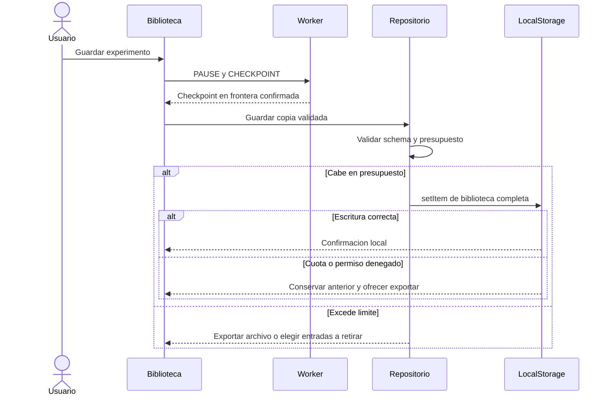
```mermaid
sequenceDiagram
  actor A as Usuario
  participant UI as Biblioteca
  participant W as Worker
  participant R as Repositorio
  participant LS as LocalStorage
  A->>UI: Guardar experimento
  UI->>W: PAUSE y CHECKPOINT
  W-->>UI: Checkpoint en frontera confirmada
  UI->>R: Guardar copia validada
  R->>R: Validar schema y presupuesto
  alt Cabe en presupuesto
    R->>LS: setItem de biblioteca completa
    alt Escritura correcta
      LS-->>UI: Confirmacion local
    else Cuota o permiso denegado
      LS-->>UI: Conservar anterior y ofrecer exportar
    end
  else Excede limite
    R-->>UI: Exportar archivo o elegir entradas a retirar
  end
```

## 10 · Estados de una actividad

UML de estados: hipótesis, experimento, observación y reflexión, con reintentos.

[Fuente Mermaid](diagrams/10-estados-taller.mmd)

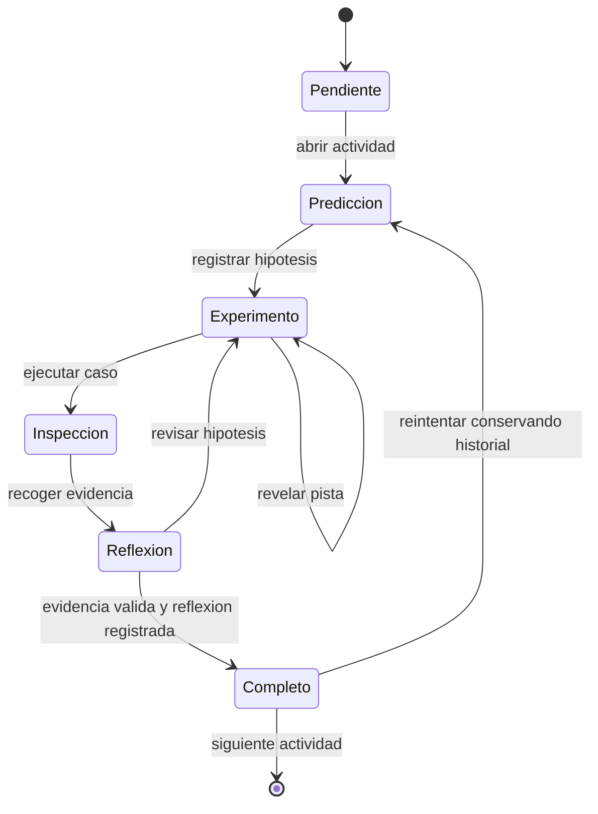
```mermaid
stateDiagram-v2
  [*] --> Pendiente
  Pendiente --> Prediccion: abrir actividad
  Prediccion --> Experimento: registrar hipotesis
  Experimento --> Inspeccion: ejecutar caso
  Inspeccion --> Reflexion: recoger evidencia
  Reflexion --> Completo: evidencia valida y reflexion registrada
  Reflexion --> Experimento: revisar hipotesis
  Experimento --> Experimento: revelar pista
  Completo --> Prediccion: reintentar conservando historial
  Completo --> [*]: siguiente actividad
```

## 11 · Despliegue estático

Vista de despliegue aproximada mediante flowchart. CI y Pages son futuros, no un remoto ya creado.

[Fuente Mermaid](diagrams/11-despliegue.mmd)

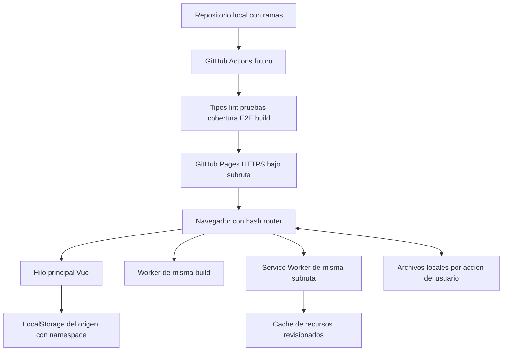
```mermaid
flowchart TB
  Git[Repositorio local con ramas] --> CI[GitHub Actions futuro]
  CI --> Check[Tipos lint pruebas cobertura E2E build]
  Check --> Pages[GitHub Pages HTTPS bajo subruta]
  Pages --> Browser[Navegador con hash router]
  Browser --> UI[Hilo principal Vue]
  Browser --> Worker[Worker de misma build]
  Browser --> SW[Service Worker de misma subruta]
  UI --> LS[LocalStorage del origen con namespace]
  SW --> Cache[Cache de recursos revisionados]
  Browser <--> Files[Archivos locales por accion del usuario]
```

## 12 · Flujo Git de desarrollo

gitGraph ilustrativo del proceso acordado, no una copia del historial real ni trabajo funcional ya realizado.

[Fuente Mermaid](diagrams/12-flujo-git.mmd)

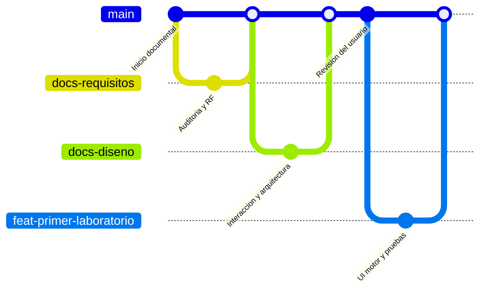
```mermaid
gitGraph
  commit id: "Inicio documental"
  branch docs-requisitos
  checkout docs-requisitos
  commit id: "Auditoria y RF"
  checkout main
  merge docs-requisitos
  branch docs-diseno
  checkout docs-diseno
  commit id: "Interaccion y arquitectura"
  checkout main
  merge docs-diseno
  commit id: "Revision del usuario"
  branch feat-primer-laboratorio
  checkout feat-primer-laboratorio
  commit id: "UI motor y pruebas"
  checkout main
  merge feat-primer-laboratorio
```

## 13 · Clases de optimizadores

UML de clases: implementaciones de un contrato pequeño y scheduler independiente.

[Fuente Mermaid](diagrams/13-clases-optimizadores.mmd)

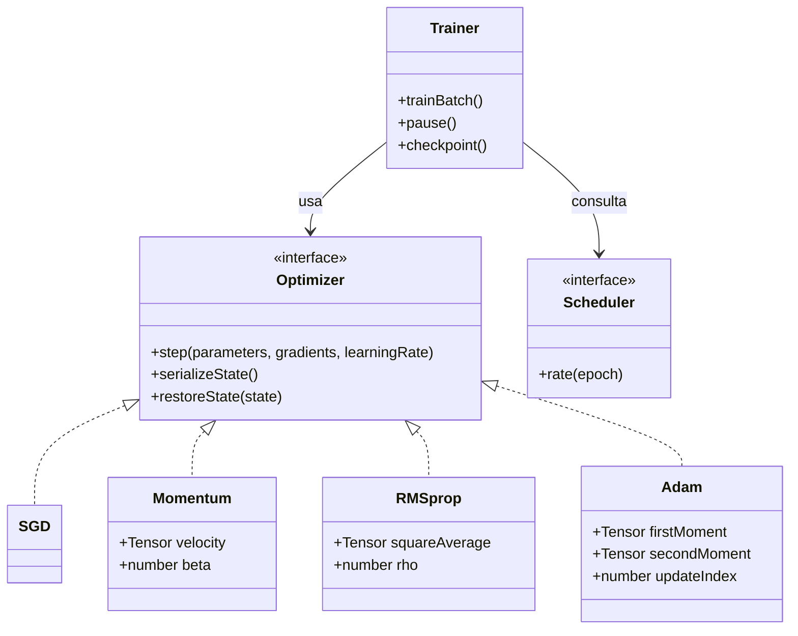
```mermaid
classDiagram
  class Optimizer {
    <<interface>>
    +step(parameters, gradients, learningRate)
    +serializeState()
    +restoreState(state)
  }
  class SGD
  class Momentum {
    +Tensor velocity
    +number beta
  }
  class RMSprop {
    +Tensor squareAverage
    +number rho
  }
  class Adam {
    +Tensor firstMoment
    +Tensor secondMoment
    +number updateIndex
  }
  class Trainer {
    +trainBatch()
    +pause()
    +checkpoint()
  }
  class Scheduler {
    <<interface>>
    +rate(epoch)
  }
  Optimizer <|.. SGD
  Optimizer <|.. Momentum
  Optimizer <|.. RMSprop
  Optimizer <|.. Adam
  Trainer --> Optimizer : usa
  Trainer --> Scheduler : consulta
```

## 14 · Cancelación y revisión

UML de secuencia: descartar cálculo parcial, nueva revisión y watchdog ante fallo.

[Fuente Mermaid](diagrams/14-secuencia-cancelacion.mmd)

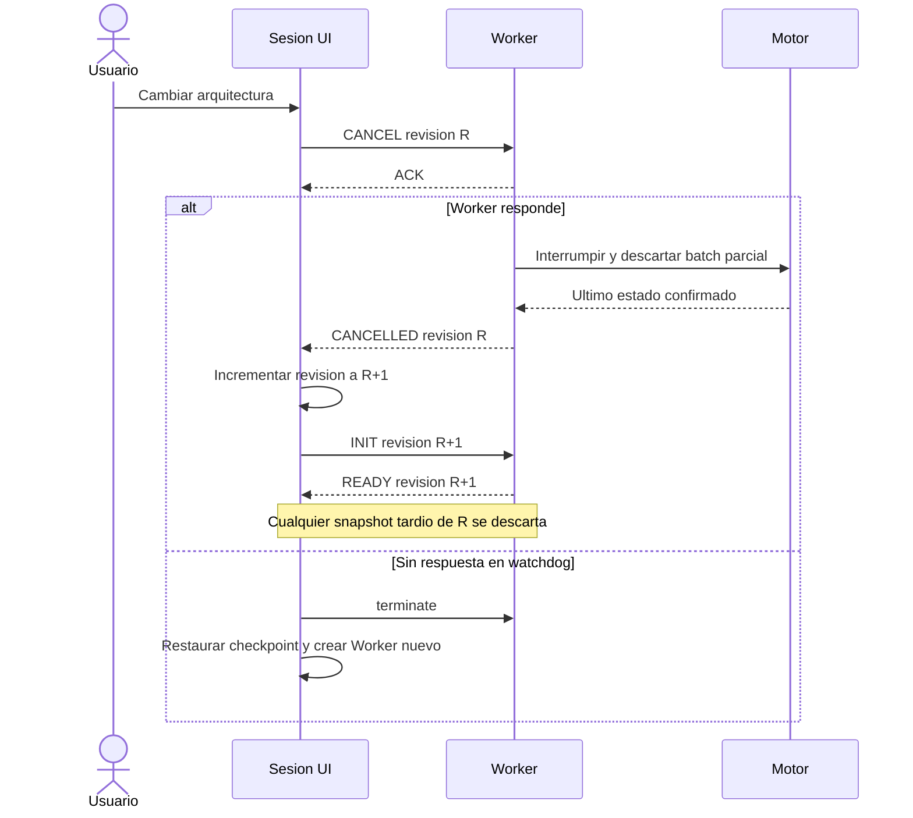
```mermaid
sequenceDiagram
  actor A as Usuario
  participant UI as Sesion UI
  participant W as Worker
  participant M as Motor
  A->>UI: Cambiar arquitectura
  UI->>W: CANCEL revision R
  W-->>UI: ACK
  alt Worker responde
    W->>M: Interrumpir y descartar batch parcial
    M-->>W: Ultimo estado confirmado
    W-->>UI: CANCELLED revision R
    UI->>UI: Incrementar revision a R+1
    UI->>W: INIT revision R+1
    W-->>UI: READY revision R+1
    Note over UI,W: Cualquier snapshot tardio de R se descarta
  else Sin respuesta en watchdog
    UI->>W: terminate
    UI->>UI: Restaurar checkpoint y crear Worker nuevo
  end
```

## 15 · Recorrido de aprendizaje

Mapa didáctico en flowchart: dependencias recomendadas, sin bloquear exploración libre.

[Fuente Mermaid](diagrams/15-recorrido.mmd)

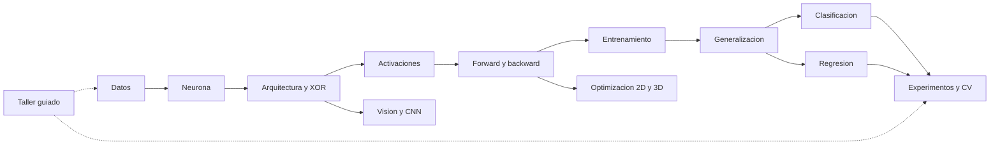
```mermaid
flowchart LR
  L01[Datos] --> L02[Neurona]
  L02 --> L03[Arquitectura y XOR]
  L03 --> L04[Activaciones]
  L04 --> L05[Forward y backward]
  L05 --> L06[Entrenamiento]
  L05 --> L07[Optimizacion 2D y 3D]
  L06 --> L08[Generalizacion]
  L08 --> L09[Clasificacion]
  L08 --> L10[Regresion]
  L09 --> L12[Experimentos y CV]
  L10 --> L12
  L03 --> L11[Vision y CNN]
  T[Taller guiado] -.-> L01
  T -.-> L12
```

## 16 · Catálogo abierto

UML de clases: conceptos y paquetes versionados; sin máximo global ni enum cerrado de IDs.

[Fuente Mermaid](diagrams/16-clases-catalogo-abierto.mmd)

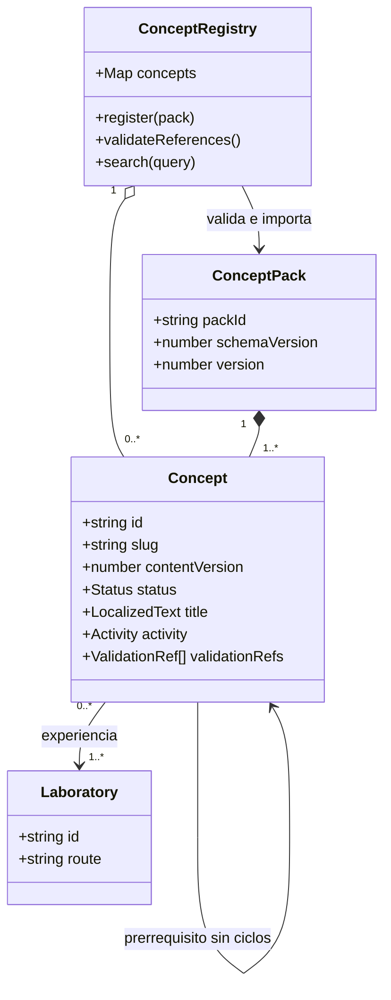
```mermaid
classDiagram
  class ConceptRegistry {
    +Map concepts
    +register(pack)
    +validateReferences()
    +search(query)
  }
  class Concept {
    +string id
    +string slug
    +number contentVersion
    +Status status
    +LocalizedText title
    +Activity activity
    +ValidationRef[] validationRefs
  }
  class ConceptPack {
    +string packId
    +number schemaVersion
    +number version
  }
  class Laboratory {
    +string id
    +string route
  }
  ConceptRegistry "1" o-- "0..*" Concept
  ConceptPack "1" *-- "1..*" Concept
  Concept --> Concept : prerrequisito sin ciclos
  Concept "0..*" --> "1..*" Laboratory : experiencia
  ConceptRegistry --> ConceptPack : valida e importa
```

## 17 · Secuencia de validación cruzada

UML de secuencia: reconstruir pipeline/modelo por fold y conservar test fuera de selección.

[Fuente Mermaid](diagrams/17-secuencia-validacion-cruzada.mmd)

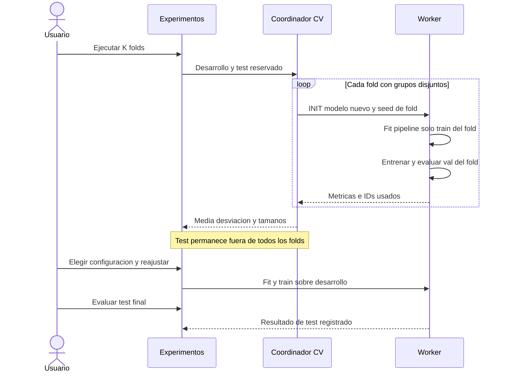
```mermaid
sequenceDiagram
  actor A as Usuario
  participant UI as Experimentos
  participant CV as Coordinador CV
  participant W as Worker
  A->>UI: Ejecutar K folds
  UI->>CV: Desarrollo y test reservado
  loop Cada fold con grupos disjuntos
    CV->>W: INIT modelo nuevo y seed de fold
    W->>W: Fit pipeline solo train del fold
    W->>W: Entrenar y evaluar val del fold
    W-->>CV: Metricas e IDs usados
  end
  CV-->>UI: Media desviacion y tamanos
  Note over UI,CV: Test permanece fuera de todos los folds
  A->>UI: Elegir configuracion y reajustar
  UI->>W: Fit y train sobre desarrollo
  A->>UI: Evaluar test final
  W-->>UI: Resultado de test registrado
```

## 18 · Estados offline y actualización

UML de estados: descarga completa comprobada y activación después de guardar/detener sesión.

[Fuente Mermaid](diagrams/18-estados-offline.mmd)

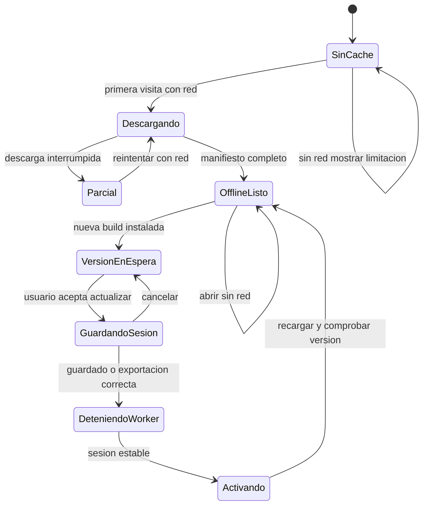
```mermaid
stateDiagram-v2
  [*] --> SinCache
  SinCache --> Descargando: primera visita con red
  Descargando --> Parcial: descarga interrumpida
  Parcial --> Descargando: reintentar con red
  Descargando --> OfflineListo: manifiesto completo
  OfflineListo --> VersionEnEspera: nueva build instalada
  VersionEnEspera --> GuardandoSesion: usuario acepta actualizar
  GuardandoSesion --> DeteniendoWorker: guardado o exportacion correcta
  GuardandoSesion --> VersionEnEspera: cancelar
  DeteniendoWorker --> Activando: sesion estable
  Activando --> OfflineListo: recargar y comprobar version
  OfflineListo --> OfflineListo: abrir sin red
  SinCache --> SinCache: sin red mostrar limitacion
```

## 19 · Clases del taller

UML de clases: definición declarativa, pasos, reglas y progreso local compatible.

[Fuente Mermaid](diagrams/19-clases-taller.mmd)

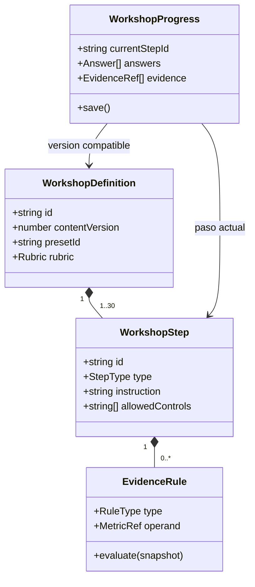
```mermaid
classDiagram
  class WorkshopDefinition {
    +string id
    +number contentVersion
    +string presetId
    +Rubric rubric
  }
  class WorkshopStep {
    +string id
    +StepType type
    +string instruction
    +string[] allowedControls
  }
  class EvidenceRule {
    +RuleType type
    +MetricRef operand
    +evaluate(snapshot)
  }
  class WorkshopProgress {
    +string currentStepId
    +Answer[] answers
    +EvidenceRef[] evidence
    +save()
  }
  WorkshopDefinition "1" *-- "1..30" WorkshopStep
  WorkshopStep "1" *-- "0..*" EvidenceRule
  WorkshopProgress --> WorkshopDefinition : version compatible
  WorkshopProgress --> WorkshopStep : paso actual
```

## 20 · Actividad de retropropagación

Actividad en flowchart: acumular gradientes antes de mutar parámetros y confirmar solo valores finitos.

[Fuente Mermaid](diagrams/20-actividad-backprop.mmd)

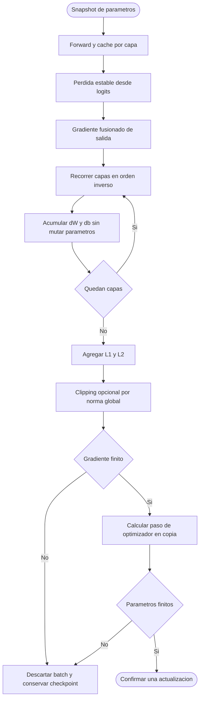
```mermaid
flowchart TD
  Start([Snapshot de parametros]) --> Forward[Forward y cache por capa]
  Forward --> Loss[Perdida estable desde logits]
  Loss --> Delta[Gradiente fusionado de salida]
  Delta --> Layers[Recorrer capas en orden inverso]
  Layers --> Acc[Acumular dW y db sin mutar parametros]
  Acc --> More{Quedan capas}
  More -->|Si| Layers
  More -->|No| Reg[Agregar L1 y L2]
  Reg --> Clip[Clipping opcional por norma global]
  Clip --> Finite{Gradiente finito}
  Finite -->|No| Error[Descartar batch y conservar checkpoint]
  Finite -->|Si| Update[Calcular paso de optimizador en copia]
  Update --> Commit{Parametros finitos}
  Commit -->|Si| Done([Confirmar una actualizacion])
  Commit -->|No| Error
```

